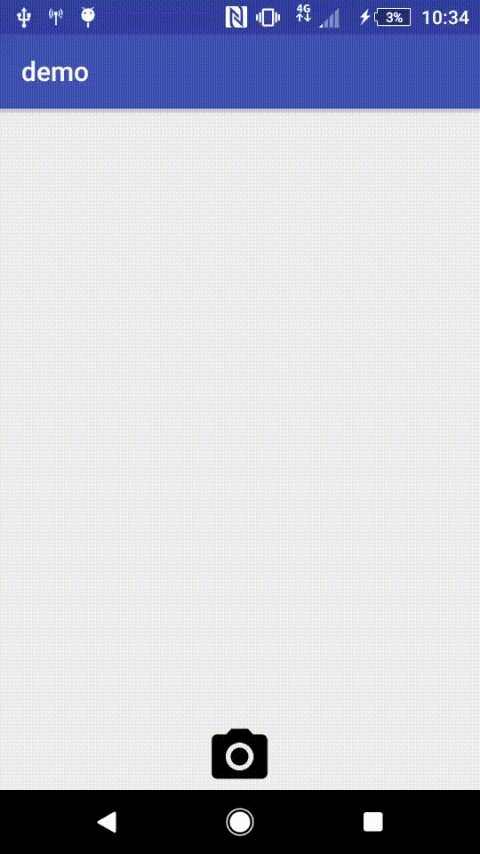

# Camera Touch Button
Simple component to capture photo

This library uses [CameraKit-Android](https://github.com/CameraKit/camerakit-android)


## Demo
<p align="center">
  
</p>

## Install
Add the dependecy in `build.gradle(module: app)`

```gradle
repositories {
    mavenCentral()
    maven {
        url  "https://safety.bintray.com/maven"
    }
}

dependencies {
  //TODO
}

```

## Usage

### XML

```xml
 <br.com.safety.camera_touch_button.CameraTouchButton
        android:id="@+id/camera_touch_button"
        android:layout_alignParentBottom="true"
        android:background="@drawable/ic_photo_camera"
        android:layout_centerInParent="true"
        android:layout_width="50dp"
        android:layout_height="50dp"
        app:camera_circle_width="280dp"
        app:camera_circle_height="280dp">
  </br.com.safety.camera_touch_button.CameraTouchButton>
```
### Kotlin
```kotlin
lateinit var cameraView: CameraView

override fun onCreate(savedInstanceState: Bundle?) {
    super.onCreate(savedInstanceState)
    setContentView(R.layout.activity_main)

    /**
     * Build CameraView
     */
    cameraView = BuilderCameraView().build(this)

    /**
     * Setup camera touch button
     */
    camera_touch_button.setup(root_layout, cameraView)

    /**
     * Listener callback photo file
     */
    camera_touch_button.setCameraListener {
        Toast.makeText(this, "Captured", Toast.LENGTH_SHORT).show()
        Log.d("camera_listener", "return photo here")
    }
}

override fun onResume() {
    super.onResume()
    cameraView.start()
}

override fun onStop() {
    super.onStop()
    cameraView.stop()
}
```

## License
    The MIT License (MIT)

    Copyright (c) Safety System Technology

    Permission is hereby granted, free of charge, to any person obtaining a
    copy of this software and associated documentation files (the "Software"),
    to deal in the Software without restriction, including without limitation
    the rights to use, copy, modify, merge, publish, distribute, sublicense,
    and/or sell copies of the Software, and to permit persons to whom the Software is
    furnished to do so, subject to the following conditions:

    The above copyright notice and this permission notice shall be included
    in all copies or substantial portions of the Software.

    THE SOFTWARE IS PROVIDED "AS IS", WITHOUT WARRANTY OF ANY KIND, EXPRESS OR IMPLIED,
    INCLUDING BUT NOT LIMITED TO THE WARRANTIES OF MERCHANTABILITY, FITNESS FOR A PARTICULAR
    PURPOSE AND NONINFRINGEMENT. IN NO EVENT SHALL THE AUTHORS OR COPYRIGHT HOLDERS BE LIABLE
    FOR ANY CLAIM, DAMAGES OR OTHER LIABILITY, WHETHER IN AN ACTION OF CONTRACT, TORT OR OTHERWISE,
    ARISING FROM, OUT OF OR IN CONNECTION WITH THE SOFTWARE OR THE USE OR OTHER DEALINGS IN THE SOFTWARE.
